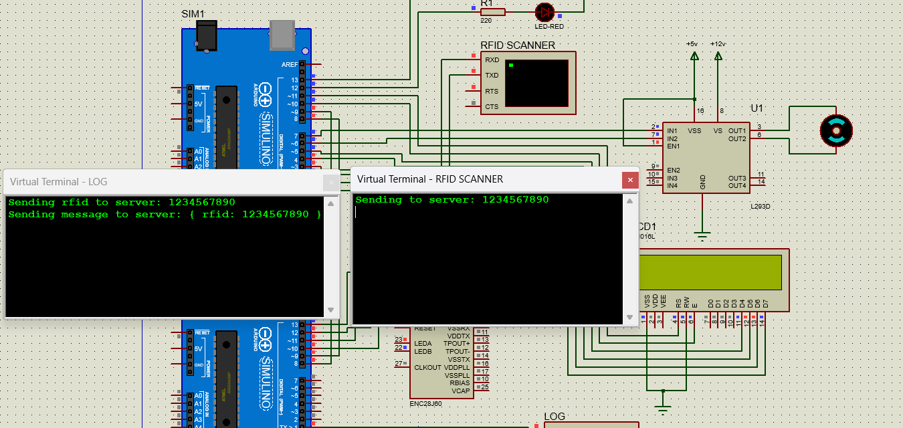

# CA1 - Access Control Management Over IOT

- [CA1 - Access Control Management Over IOT](#ca1---access-control-management-over-iot)
  - [Introduction](#introduction)
  - [Description](#description)
    - [Embedded](#embedded)
    - [Proteus](#proteus)
    - [Server](#server)
      - [HTTP Server](#http-server)
      - [WebSocket Server](#websocket-server)
    - [Client](#client)
  - [Explanation](#explanation)
    - [Embedded](#embedded-1)
      - [RFID Scanner embedding](#rfid-scanner-embedding)
      - [Ethernet Handler](#ethernet-handler)
    - [Proteus](#proteus-1)
    - [Server](#server-1)
      - [HTTP Server](#http-server-1)
        - [RFID Authenticator](#rfid-authenticator)
        - [HttpServer](#httpserver)
      - [WebSocket Server](#websocket-server-1)
        - [Monitoring System User](#monitoring-system-user)
        - [Monitoring System Authenticator](#monitoring-system-authenticator)
        - [RFID Authentication Item](#rfid-authentication-item)
        - [RFID Authentication History](#rfid-authentication-history)
        - [WebSocket Request](#websocket-request)
        - [WebSocket Response](#websocket-response)
        - [WebSocket Server](#websocket-server-2)
    - [Client](#client-1)
      - [Folder Structure](#folder-structure)
      - [GUI Changes](#gui-changes)
      - [Widgets](#widgets)
      - [Windows](#windows)
      - [Users](#users)
        - [User](#user)
        - [RFID User](#rfid-user)
      - [WebSocket Request](#websocket-request-1)
      - [WebSocket Response](#websocket-response-1)
      - [WebSocket Client](#websocket-client)
        - [Constructor](#constructor)
        - [Signals](#signals)
        - [Public Slots](#public-slots)
        - [Private Slots](#private-slots)
      - [Application](#application)
  - [How to Run](#how-to-run)
    - [Running Hidden Embedded System in Proteus](#running-hidden-embedded-system-in-proteus)
    - [Running the Server](#running-the-server)
    - [Running the Client](#running-the-client)
    - [Testing Everything Together](#testing-everything-together)
  - [RFID](#rfid)
    - [RFID Tag](#rfid-tag)
    - [RFID Reader](#rfid-reader)
    - [RFID Interface](#rfid-interface)
    - [RFID in the Project](#rfid-in-the-project)

## Introduction

This project is an access control management system that uses RFID technology to authenticate users. When a user tries to access a secure area, they need to present an RFID tag to the RFID reader. The reader reads the information stored on the tag and sends it to the server for authentication. The server checks if the user is allowed to access the area and sends a response back to the reader. If the user is authenticated, the reader grants access to the user. If the user is not authenticated, the reader denies access to the user. If the user is authenticated, the door is opened for 30 seconds and then closed. If the user is not authenticated, the door is not opened or it will be closed if it is already opened. In addition to the access control system, the project also includes a monitoring system that shows the status of the access control system in real-time and can retrieve the access history of the users. This system needs to be authenticated using a username and password before accessing the monitoring system. The monitoring system shows the access history of the users, including the username, time, and date of the access.

## Description

The project consists of four main components: the embedded system, the Proteus simulation, the server, and the monitoring system client. The embedded system is responsible for reading the RFID tag and sending the information to the server for authentication. The Proteus simulation simulates the RFID reader and the door that is controlled by the embedded system. The server is responsible for authenticating the users and controlling the access to the secure area. The monitoring system client is responsible for showing the status of the access control system and retrieving the access history of the users.

The steps are as follows:

1. The monitoring system client sends an authentication request to the server with the username and password of the user.
2. The server checks if the user is allowed to access the monitoring system and sends a response back to the client.
3. A user tries to access the secure area by presenting an RFID tag to the RFID reader.
4. The reader reads the information stored on the tag and sends it to the server for authentication.
5. The server checks if the user is allowed to access the area and sends a response back to the reader.
   1. If the user is authenticated, the reader grants access to the user.
      1. The server sends an authenticated user message to the embedded system which opens the door for 30 seconds.
      2. The server sends an authenticated user message to the monitoring system client which shows the user's information and an `Access Granted` message.
   2. If the user is not authenticated, the reader denies access to the user.
      1. The server sends an unauthenticated user message to the embedded system which does not open the door or closes the door if it is already opened.
      2. The server sends an unauthenticated user message to the monitoring system client which shows the user's information and an `Access Denied` message.
6. The server stores the access history of the users and sends the access history to the monitoring system client when requested.

### Embedded

This part includes Arduino scripts for each of the boards. One of them is [ethernet-handler](./Embedded/ethernet-handler/) and the other one is the [embedded-rfid-scanner](./Embedded/embedded-rfid-scanner/). the first one is responsible for fetching the RFID and sending it to the server via an ethernet module. It then waits for the server response and forwards it to the other Arduino. The second Arduino is responsible for getting the result information and using the actuators. For someone with an unrecognized RFID, it turns the red light on and prints the proper message on the screen. For a person who has access, it turns on the green light.

### Proteus

This part is where all the needed modules for the hidden embedded system are connected together. Two Arduinos, an ethernet module, and some actuators like LEDs, LCD, and DC motors are the modules included in this project. The RFID Scanner is simulated using a virtual terminal.

### Server

#### HTTP Server

#### WebSocket Server

The WebSocket server is responsible for handling the communication between the Monitoring System client and the server. The server is implemented using the `QtWebSockets` library and it listens on port `12345` by default. However, this can be changed by providing the `--websocket-port` argument when running the server. It is responsible for handling the following messages:

- `authenticate`: This message is sent by the client when it wants to authenticate a user. The server will then check if the user is allowed to access the system and respond with a message indicating if the user is allowed or not. The message contains the username and password (base64-encoded) of the user that is trying to authenticate. The server will then respond with a json message with status set to either 200 (OK) or 401 (Unauthorized). The messages format are as follows:

  ```json
  // client -> server
  {
      "type": "authenticate",
      "data": {
          "username": "admin",
          "password": "MTIzNA=="
      }
  }
  ```

  ```json
  // server -> client
  {
      "status": 200 | 401,
      "data": {}
  }
  ```

- `history_request`: This message is sent by the client to retrieve the RFID access history. The server will then respond with a message containing the access history. If the user is not authenticated, the server will respond with a status of 401 (Unauthorized). The messages format are as follows:

  ```json
  // client -> server
  {
      "type": "history_request",
      "data": {}
  }
  ```

  ```json
  // server -> client
  {
      "status": 200 | 401,
      "data": [
          {
              "username": "1234567890",
              "time": "10:10",
              "date": "10/28/2021"
          }
      ]
  }
  ```

- `access_request`: This message is sent by the server to the client whenever a user tries to authenticate using the RFID reader. The server will then send a message to the client containing the username of the user that is trying to authenticate. The client will then display a message to the user indicating that the user is trying to authenticate. The status of the message will either be 200 (OK) or 403 (Forbidden). The messages format are as follows:

  ```json
  // server -> client
  {
      "status": 200 | 403,
      "data": {
          "username": "1234567890",
          "time": "10:10",
          "date": "10/28/2021"
      }
  }
  ```

The access request history is stored in `data/monitoring_system_history.json` and the client authentication information is stored in `data/monitoring_system_users.json`.

### Client

The client monitoring system is a GUI program implemented using the **Qt** framework.  
The monitoring system creates a websocket connection to the server and receives new users and the entrance history after authenticating.

The right panel of the GUI is used to enter the address of the server and the username and password of the user. After clicking the authenticate button, a request is send to the server. If the credentials are correct, the client will now start receiving data from the server whenever a new user scans their RFID. The user will be displayed on the left panel of the GUI.  
It is also possible to request the entrance history by clicking the history button. The full history will be displayed on a new window.

The format of the data transmitted between the server and the client is explained in the [server description](#websocket-server) section.

## Explanation

### Embedded

This part includes implementations of two Arduinos used in this project. One is responsible for embedding the RFID Scanner into the system and the other is for connecting it to the ethernet.

#### RFID Scanner embedding

Let's start from the `loop` function to grasp a general idea of what this part is doing.

```cpp
void loop() {
  static State currentState;
  static char rfidBuff[11] = { 0 };
  static bool isSentToServer = false;

  int rfidLen = readRfid(rfidBuff);

  if (rfidLen != RFID_LEN)
    isSentToServer = false;
  if (!isSentToServer && rfidLen == RFID_LEN) {
    sendToServer(rfidBuff);
    isSentToServer = true;
    executeServerCommand(currentState);
  }

  stabalize(currentState);
}
```

It first starts by initializing the `State`, which we'll get back to it. It then tries to read the RFID tag character by character. In order not to block the whole process, just waiting for the RFID Scanner, we read the tag character by character and then proceeds to send it to the server. This is done with the `readRfid` function and the `isSentToServer` flag.
After reading the tag, it sends it to the other Arduino through the `Serial` stream. After this it waits for the server response. Note that server will reply no matter what, so blocking on this part makes sense as if the server is out of reach, the door system should not work either. Still we have a time out mechanism for this part as follows:

```cpp
int readServerCommand(char buffer[], int maxLen, unsigned long timeOut) {
  unsigned long start = millis();
  int counter = 0;

  while (true) {
    if (millis() - start > timeOut)
      break;
    if (counter >= maxLen)
      break;
    if (!ethernetModule.available())
      continue;

    buffer[counter++] = (char)ethernetModule.read();
    if (isValidServerCommand(buffer))
      break;
  }

  return counter;
}
```

It tries to read the server answer character by character until a valid server command is seen. It will abort the process if time exceeds the `timeOut` amount.

After receiving the server's reply, we'll call `grantAccess` or `denyAccess` accordingly. The `grantAccess` will turn on the green light and call the `openDoor`. The `denyAccess` will turn the red light on and call the `closeDoor`.

Now let's go back to the `State`. There are some events happening at the same time. For example a timer should count the amount of time the door has been open and close it if after 30 seconds. We can't block everything and count until 30! So we'll create this `State` struct that holds information of the current state. For example it'll remember the last time that the door got opened. It'll be called on every iteration and check if door should be closed. The `stabilize` function has the responsibility of checking the `currentState` every iteration and corrects it if needed.

#### Ethernet Handler

This module has the job of getting the RFID tag from the first Arduino, sending it to the server, and receiving the answer. Let's take a look into the `loop` function and see what happens in every iteration.

```cpp
void loop() {
  char rfid[RFID_LENGHT] = { 0 };
  static byte session;

  ether.packetLoop(ether.packetReceive());
  if (readRfid(rfid)) {
    session = sendToServer(rfid);
  }
  const char* serverResponsePacket = ether.tcpReply(session);
  if (serverResponsePacket != nullptr) {
    ServerRespone serverResponse = handleServerResponse(serverResponsePacket);
    callback(serverResponse);
  }
}
```

the first part is the call to the `packetLoop` and `packetReceive`. These two together form the main loop of packet handling in `EtherCard.h`. It then reads the RFID if it is available and ignores the reading if not. After reading it we will send it to the server with an HTTP Post request and wait for a reply. In the end we'll `callback` the first Arduino and notify it of the result.

### Proteus

The whole diagram created in Proteus is as below:


It consists of two Arduinos, on for embedding RFID Scanner, and the other for connecting the ethernet module. There is a dc motor to open and close the door. There are also green and red lights and an lcd to inform the user of the authentication result. A virtual terminal is used to act as an RFID scanner.
The ethernet module is connected to one of the Arduinos and it's IP is set to `192.168.2.1` as the picture below shows:


This is the gateway IP that Arduino will use to send its requests to the server. This also the same IP as the KM-Test loopback adaptor installed on the localhost to test and simulate the whole system on a single machine. The picture below shows a part of the Proteus simulation:



### Server
In main.cpp, at the beginning of the file, the command line arguments are parsed to get the port numbers for the WebSocket server and the HTTP server. The default port numbers are 12345 and 54321 respectively. The monitoring system authenticator, the RFID authentication history, and the RFID authenticator are created with the following code:

```cpp
auto monitoringSystemAuthenticator = new CPS::MonitoringSystemAuthenticator(MONITORING_SYSTEM_USERS_JSON_FILE_PATH);
auto rfidAuthenticationHistory = new CPS::RfidAuthenticationHistory(RFID_AUTHENTICATION_HISTORY_JSON_FILE_PATH);
auto rfidAuthenticator = new CPS::RfidAuthenticator(RFID_TAGS_JSON_FILE_PATH);
```

The WebSocket server and the HTTP server are created with the following code:

```cpp
auto webSocketServer = new CPS::WebSocketServer(webSocketPort);
auto httpServer = new CPS::HttpServer(httpPort, rfidAuthenticator);
```

The signals and slots are connected with the following code:

```cpp
QObject::connect(rfidAuthenticator, &CPS::RfidAuthenticator::authenticated, rfidAuthenticationHistory, &CPS::RfidAuthenticationHistory::addItem);
QObject::connect(rfidAuthenticator, &CPS::RfidAuthenticator::authenticated, webSocketServer, &CPS::WebSocketServer::sendAuthenticatedUser);
QObject::connect(rfidAuthenticator, &CPS::RfidAuthenticator::unauthenticated, webSocketServer, &CPS::WebSocketServer::sendUnauthenticatedUser);

QObject::connect(webSocketServer, &CPS::WebSocketServer::clientAuthenticationRequested, monitoringSystemAuthenticator, &CPS::MonitoringSystemAuthenticator::authenticate);
QObject::connect(monitoringSystemAuthenticator, &CPS::MonitoringSystemAuthenticator::authenticated, webSocketServer, &CPS::WebSocketServer::authenticated);
QObject::connect(monitoringSystemAuthenticator, &CPS::MonitoringSystemAuthenticator::unauthenticated, webSocketServer, &CPS::WebSocketServer::unauthenticated);

QObject::connect(webSocketServer, &CPS::WebSocketServer::historyRequested, rfidAuthenticationHistory, &CPS::RfidAuthenticationHistory::historyRequested);
QObject::connect(rfidAuthenticationHistory, &CPS::RfidAuthenticationHistory::historyReady, webSocketServer, &CPS::WebSocketServer::sendHistory);
```

The monitoring system authenticator, the RFID authentication history, the WebSocket server, and the HTTP server are deleted when the application is about to quit with the following code:

```cpp
QObject::connect(&a, &QCoreApplication::aboutToQuit, monitoringSystemAuthenticator, &CPS::MonitoringSystemAuthenticator::deleteLater);
QObject::connect(&a, &QCoreApplication::aboutToQuit, rfidAuthenticationHistory, &CPS::RfidAuthenticationHistory::deleteLater);
QObject::connect(&a, &QCoreApplication::aboutToQuit, webSocketServer, &CPS::WebSocketServer::deleteLater);
QObject::connect(&a, &QCoreApplication::aboutToQuit, [&]() {
    qDebug() << "CPS Server stopped";
});
```

The server is started with the following code:

```cpp
return a.exec();
```


#### HTTP Server

##### RFID Authenticator

This class has the header file `rfidauthenticator.h` and the implementation file `rfidauthenticator.cpp`. It is responsible for authenticating the users that are trying to access the secure area. The header file contains the following:

```cpp
#ifndef RFIDAUTHENTICATOR_H
#define RFIDAUTHENTICATOR_H

#include <QObject>
#include <QString>

#include "rfidauthenticationitem.h"

namespace CPS {

class RfidAuthenticator : public QObject {
    Q_OBJECT
public:
    RfidAuthenticator(const QString& jsonFilePath);
    bool authenticate(const RfidAuthenticationItem& rfidAuthenticationItem);

Q_SIGNALS:
    void authenticated(RfidAuthenticationItem item);
    void unauthenticated(RfidAuthenticationItem item);

private:
    void LoadTags();

private:
    QString jsonFilePath_;
    QList<QString> rfidTags_;
};

} // namespace CPS

#endif // RFIDAUTHENTICATOR_H
```

`LoadTags` method is responsible for loading the RFID tags from the json file. The `authenticate` method is responsible for authenticating the user using the RFID tag information. It emits the authenticated signal if the user is authenticated and the unauthenticated signal if the user is not authenticated. The implementation file contains the following:


```cpp
#include "rfidauthenticator.h"

#include <QJsonArray>
#include <QJsonDocument>
#include <QJsonObject>

#include "utils.h"

namespace CPS {

RfidAuthenticator::RfidAuthenticator(const QString& jsonFilePath)
    : jsonFilePath_(jsonFilePath) {
    LoadTags();
}

bool RfidAuthenticator::authenticate(const RfidAuthenticationItem& rfidAuthenticationItem) {
    if (rfidTags_.contains(rfidAuthenticationItem.username())) {
        emit authenticated(rfidAuthenticationItem);
        return true;
    }
    else {
        emit unauthenticated(rfidAuthenticationItem);
        return false;
    }
}

void RfidAuthenticator::LoadTags() {
    qDebug() << "Loading tags from" << jsonFilePath_;
    QByteArray jsonFile = Utils::readFile(jsonFilePath_);
    QJsonDocument jsonDocument = QJsonDocument::fromJson(jsonFile);
    QJsonArray array = jsonDocument.array();

    for (const QJsonValue& value : array) {
        rfidTags_ << value.toString();
        qDebug() << "Tag" << value.toString() << "loaded";
    }
}

} // namespace CPS
```

##### HttpServer

This class has the header file `httpserver.h` and the implementation file `httpserver.cpp`. It is responsible for handling the HTTP requests from the embedded system. The header file contains the following:

```cpp
#ifndef HTTPSERVER_H
#define HTTPSERVER_H

#include <QHttpServer>

#include "rfidauthenticator.h"

namespace CPS {

class HttpServer : public QObject {
    Q_OBJECT
public:
    HttpServer(int port, RfidAuthenticator* rfidAuthenticator);
    ~HttpServer();
    void start();
    void stop();
    QHttpServerResponse authenticationHandler(const QHttpServerRequest& request);

private:
    int port_;
    QHttpServer* server_;
    RfidAuthenticator* rfidAuthenticator_;
};

} // namespace CPS

#endif // HTTPSERVER_H
```
It can be constructed using the port that the server will listen on and the `RfidAuthenticator` object that is responsible for authenticating the users. It has a method `start` that starts the server, a method `stop` that stops the server, and a method `authenticationHandler` that handles the authentication request. The implementation file contains the following:
    
```cpp
#include "httpserver.h"

#include <QHttpServerRequest>
#include <QHttpServerResponse>
#include <QJsonArray>
#include <QJsonDocument>
#include <QJsonObject>

namespace CPS {

HttpServer::HttpServer(int port, RfidAuthenticator* rfidAuthenticator)
    : port_{port}, server_(new QHttpServer()), rfidAuthenticator_(rfidAuthenticator) {
    server_->route("/authentication", [this](const QHttpServerRequest& request) {
        return this->authenticationHandler(request);
    });

    start();
}

void HttpServer::start() {
    if (!server_->listen(QHostAddress::Any, port_)) {
        qFatal("Failed to listen on port %d", port_);
        return;
    }
    qInfo() << "Listening on port" << port_;
}

void HttpServer::stop() {
    server_->disconnect();
}

QHttpServerResponse HttpServer::authenticationHandler(const QHttpServerRequest& request) {
    qDebug() << "Received request:" << request.url().toString();

    QByteArray jsonData = request.body();
    QJsonDocument jsonDoc = QJsonDocument::fromJson(jsonData);

    if (!jsonDoc.isObject()) {
        return QHttpServerResponse(QByteArray("Error: JSON is not an object"), QHttpServerResponse::StatusCode::BadRequest);
    }

    QJsonObject jsonObj = jsonDoc.object();
    if (!jsonObj.contains("rfid") || !jsonObj["rfid"].isString()) {
        return QHttpServerResponse(QByteArray("Error: JSON object does not contain a 'rfid' string"), QHttpServerResponse::StatusCode::BadRequest);
    }

    QString rfid = jsonObj["rfid"].toString();
    RfidAuthenticationItem rfidAuthenticationItem(rfid);
    QJsonDocument responseJsonDoc(rfidAuthenticationItem.toJsonObject());
    QByteArray responseJsonData = responseJsonDoc.toJson();
    QHttpServerResponse::StatusCode statusCode = rfidAuthenticator_->authenticate(rfidAuthenticationItem)
                                                     ? QHttpServerResponse::StatusCode::Ok
                                                     : QHttpServerResponse::StatusCode::Unauthorized;

    return QHttpServerResponse(responseJsonData, statusCode);
}

HttpServer::~HttpServer() {
    server_->deleteLater();
}

} // namespace CPS
```

The server is started in the constructor and stopped in the destructor. The server listens on the port provided in the constructor.

The `authenticationHandler` method handles the authentication request. It reads the RFID tag information from the request and creates an `RfidAuthenticationItem` object. It then authenticates the user using the `RfidAuthenticator` object and sends a response back to the embedded system with the user information. The server listens on the `/authentication` route and responds with a status code of 200 (OK) if the user is authenticated and 401 (Unauthorized) if the user is not authenticated.


#### WebSocket Server

##### Monitoring System User

This class has the header file `monitoringsystemuser.h` and the implementation file `monitoringsystemuser.cpp`. It is the data structure that holds the information of the user that is trying to authenticate. The header file contains the following:

```cpp
#ifndef MONITORINGSYSTEMUSER_H
#define MONITORINGSYSTEMUSER_H

#include <QJsonObject>
#include <QString>

namespace CPS {

class MonitoringSystemUser {
public:
    MonitoringSystemUser(const QString& username, const QString& hashedPassword);
    MonitoringSystemUser(const QJsonObject& jsonObject);
    QString username() const;
    QString hashedPassword() const;
    QJsonObject toJsonObject() const;

private:
    QString username_;
    QString hashedPassword_;
};

} // namespace CPS

#endif // MONITORINGSYSTEMUSER_H
```

It can be constructed using the username and hashed password of the user. It also has a constructor that takes a `QJsonObject` as an argument and constructs the object from the json object. It also has a `toJsonObject` method that converts the object to a `QJsonObject`. The implementation file contains the following:

```cpp
#include "monitoringsystemuser.h"

namespace CPS {

MonitoringSystemUser::MonitoringSystemUser(const QString& username, const QString& hashedPassword)
    : username_(username), hashedPassword_(hashedPassword) {}

MonitoringSystemUser::MonitoringSystemUser(const QJsonObject& jsonObject) {
    username_ = jsonObject["username"].toString();
    hashedPassword_ = jsonObject["hashedPassword"].toString();
}

QString MonitoringSystemUser::username() const { return username_; }

QString MonitoringSystemUser::hashedPassword() const { return hashedPassword_; }

QJsonObject MonitoringSystemUser::toJsonObject() const {
    QJsonObject jsonObject;
    jsonObject["username"] = username_;
    jsonObject["hashedPassword"] = hashedPassword_;
    return jsonObject;
}

} // namespace CPS
```

##### Monitoring System Authenticator

This class has the header file `monitoringsystemauthenticator.h` and the implementation file `monitoringsystemauthenticator.cpp`. It is responsible for authenticating the user that is trying to authenticate. The header file contains the following:

```cpp
#ifndef MONITORINGSYSTEMAUTHENTICATOR_H
#define MONITORINGSYSTEMAUTHENTICATOR_H

#include <QJsonArray>
#include <QList>
#include <QObject>
#include <QString>

#include "monitoringsystemuser.h"

namespace CPS {

class MonitoringSystemAuthenticator : public QObject {
    Q_OBJECT
public:
    MonitoringSystemAuthenticator(const QString& jsonFilePath);
    ~MonitoringSystemAuthenticator();
    void addUser(const QString& username, const QString& password);

Q_SIGNALS:
    void authenticated();
    void unauthenticated();

public Q_SLOTS:
    void authenticate(const QString& username, const QString& password);

private:
    void loadUsers();
    void saveUsers();
    QString decodePassword(const QString& encodedPassword);
    QString hashPassword(const QString& password);

private:
    QString jsonFilePath_;
    QList<MonitoringSystemUser> users_;
};

} // namespace CPS

#endif // MONITORINGSYSTEMAUTHENTICATOR_H
```

It can be constructed using the path to the json file that contains the user information. It has a method `addUser` that adds a user to the list of users. It also has a signal `authenticated` that is emitted when the user is authenticated and a signal `unauthenticated` that is emitted when the user is not authenticated. It also has a slot `authenticate` that is called when the user tries to authenticate. The implementation file contains the following:

```cpp
#include "monitoringsystemauthenticator.h"

#include <QCryptographicHash>
#include <QJsonArray>
#include <QJsonDocument>
#include <QJsonObject>

#include "utils.h"

namespace CPS {

MonitoringSystemAuthenticator::MonitoringSystemAuthenticator(const QString& jsonFilePath)
    : jsonFilePath_(jsonFilePath) {
    loadUsers();
}

MonitoringSystemAuthenticator::~MonitoringSystemAuthenticator() { saveUsers(); }

void MonitoringSystemAuthenticator::authenticate(const QString& username, const QString& password) {
    QString decodedPassword = decodePassword(password);
    QString hashedPassword = hashPassword(decodedPassword);
    for (const MonitoringSystemUser& user : users_) {
        if (user.username() == username &&
            user.hashedPassword() == hashedPassword) {
            qDebug() << "User" << username << "authenticated";
            Q_EMIT authenticated();
            return;
        }
    }
    qDebug() << "User" << username << "not authenticated";
    Q_EMIT unauthenticated();
}

void MonitoringSystemAuthenticator::addUser(const QString& username, const QString& password) {
    QString hashedPassword = hashPassword(password);
    MonitoringSystemUser user(username, hashedPassword);
    users_ << user;
    qDebug() << "User" << username << "added";
}

void MonitoringSystemAuthenticator::loadUsers() {
    qDebug() << "Loading users from" << jsonFilePath_;
    QByteArray jsonFile = Utils::readFile(jsonFilePath_);
    QJsonDocument jsonDocument = QJsonDocument::fromJson(jsonFile);
    QJsonArray jsonArray = jsonDocument.array();

    for (const QJsonValue& jsonValue : jsonArray) {
        QJsonObject jsonObject = jsonValue.toObject();
        MonitoringSystemUser user(jsonObject);
        users_ << user;
        qDebug() << "User" << user.username() << "loaded";
    }
}

void MonitoringSystemAuthenticator::saveUsers() {
    qDebug() << "Saving users to" << jsonFilePath_;
    QJsonArray jsonArray;
    for (const MonitoringSystemUser& user : users_) {
        jsonArray << user.toJsonObject();
    }

    QJsonDocument jsonDocument(jsonArray);
    QByteArray jsonFile = jsonDocument.toJson();
    Utils::writeFile(jsonFilePath_, jsonFile);
}

QString MonitoringSystemAuthenticator::decodePassword(const QString& encodedPassword) {
    QByteArray decodedPassword = QByteArray::fromBase64(encodedPassword.toUtf8());
    return QString::fromUtf8(decodedPassword);
}

QString MonitoringSystemAuthenticator::hashPassword(const QString& password) {
    QByteArray hashedPassword = QCryptographicHash::hash(password.toUtf8(), QCryptographicHash::Sha256);
    return QString::fromUtf8(hashedPassword.toHex());
}

} // namespace CPS
```

The `loadUser` method loads the users from the json file and the `saveUsers` method saves the users to the json file. The `decodePassword` method decodes the base64-encoded password and the `hashPassword` method hashes the password using SHA-256 algorithm.

##### RFID Authentication Item

This class has the header file `rfidauthenticationitem.h` and the implementation file `rfidauthenticationitem.cpp`. It is the data structure that holds the information of the RFID authentication item. The header file contains the following:

```cpp
#ifndef RFIDAUTHENTICATIONITEM_H
#define RFIDAUTHENTICATIONITEM_H

#include <QJsonObject>
#include <QString>

namespace CPS {

class RfidAuthenticationItem {
public:
    RfidAuthenticationItem(const QString& username, const QString& time, const QString& date);
    RfidAuthenticationItem(const QJsonObject& jsonObject);
    RfidAuthenticationItem(const QString& username);
    QJsonObject toJsonObject() const;
    QString username() const;

private:
    QString username_;
    QString time_;
    QString date_;
};

} // namespace CPS

#endif // RFIDAUTHENTICATIONITEM_H
```

It can be constructed using the username, time, and date of the RFID authentication item. It also has a constructor that takes a `QJsonObject` as an argument and constructs the object from the json object. This class has a third constructor that takes only the username of the RFID authentication item. In this case, the time and date are set to the current time and date. It also has a `toJsonObject` method that converts the object to a `QJsonObject`. The implementation file contains the following:

```cpp
#include "rfidauthenticationitem.h"

#include <QDateTime>

namespace CPS {

RfidAuthenticationItem::RfidAuthenticationItem(const QString& username, const QString& time, const QString& date)
    : username_(username), time_(time), date_(date) {}

RfidAuthenticationItem::RfidAuthenticationItem(const QJsonObject& jsonObject)
    : username_(jsonObject["username"].toString()),
      time_(jsonObject["time"].toString()),
      date_(jsonObject["date"].toString()) {}

RfidAuthenticationItem::RfidAuthenticationItem(const QString& username)
    : username_(username),
      time_(QDateTime::currentDateTime().toString("hh:mm")),
      date_(QDateTime::currentDateTime().toString("MM/dd/yyyy")) {}

QJsonObject RfidAuthenticationItem::toJsonObject() const {
    QJsonObject jsonObject;
    jsonObject["username"] = username_;
    jsonObject["time"] = time_;
    jsonObject["date"] = date_;
    return jsonObject;
}

QString RfidAuthenticationItem::username() const { return username_; }

} // namespace CPS
```

##### RFID Authentication History

This class has the header file `rfidauthenticationhistory.h` and the implementation file `rfidauthenticationhistory.cpp`. It is responsible for storing the RFID authentication history. The header file contains the following:

```cpp
#ifndef RFIDAUTHENTICATIONHISTORY_H
#define RFIDAUTHENTICATIONHISTORY_H

#include <QJsonArray>
#include <QObject>

#include "rfidauthenticationitem.h"

namespace CPS {

class RfidAuthenticationHistory : public QObject {
    Q_OBJECT
public:
    RfidAuthenticationHistory(const QString& historyFilePath);
    ~RfidAuthenticationHistory();

Q_SIGNALS:
    void historyReady(const QJsonArray& history);

public Q_SLOTS:
    void addItem(const RfidAuthenticationItem& item);
    void historyRequested();

private:
    void loadHistory();
    void saveHistory();

private:
    QString historyFilePath_;
    QList<RfidAuthenticationItem> history_;
};

} // namespace CPS

#endif // RFIDAUTHENTICATIONHISTORY_H
```

It can be constructed using the path to the json file that contains the RFID authentication history. It has a signal `historyReady` that is emitted when the history is ready. It also has a slot `addItem` that adds an item to the history and a slot `historyRequested` that is called when the history is requested. The implementation file contains the following:

```cpp
#include "rfidauthenticationhistory.h"

#include <QJsonArray>
#include <QJsonDocument>
#include <QJsonObject>

#include "utils.h"

namespace CPS {

RfidAuthenticationHistory::RfidAuthenticationHistory(const QString& historyFilePath) {
    historyFilePath_ = historyFilePath;
    loadHistory();
}

RfidAuthenticationHistory::~RfidAuthenticationHistory() { saveHistory(); }

void RfidAuthenticationHistory::addItem(const RfidAuthenticationItem& item) {
    history_ << item;
}

void RfidAuthenticationHistory::historyRequested() {
    QJsonArray array;
    for (const auto& item : history_) {
        array << item.toJsonObject();
    }

    Q_EMIT historyReady(array);
}

void RfidAuthenticationHistory::loadHistory() {
    history_.clear();
    qDebug() << "Loading history from" << historyFilePath_;

    QByteArray data = Utils::readFile(historyFilePath_);
    QJsonDocument doc = QJsonDocument::fromJson(data);
    QJsonArray array = doc.array();

    for (const auto& item : array) {
        RfidAuthenticationItem authItem(item.toObject());
        history_ << authItem;
    }
}

void RfidAuthenticationHistory::saveHistory() {
    qDebug() << "Saving history to" << historyFilePath_;
    QJsonArray array;
    for (const auto& item : history_) {
        array << item.toJsonObject();
    }

    QJsonDocument doc(array);
    QByteArray data = doc.toJson();
    Utils::writeFile(historyFilePath_, data);
}

} // namespace CPS
```

The `loadHistory` method loads the history from the json file and the `saveHistory` method saves the history to the json file.

##### WebSocket Request

This class has the header file `websocketrequest.h` and the implementation file `websocketrequest.cpp`. It is responsible for handling the WebSocket requests. The header file contains the following:

```cpp
#ifndef WEBSOCKETREQUEST_H
#define WEBSOCKETREQUEST_H

#include <QJsonObject>

namespace CPS {

class WebSocketRequest {
public:
    enum class Type {
        Unknown,
        Authenticate,
        HistoryRequest
    };

    WebSocketRequest(const QJsonObject& json);
    Type type() const;
    QJsonObject data() const;

private:
    Type type_;
    QJsonObject data_;
};

} // namespace CPS

#endif // WEBSOCKETREQUEST_H
```

It can be constructed using a `QJsonObject` that contains the WebSocket request. It has a method `type` that returns the type of the request and a method `data` that returns the data of the request. The implementation file contains the following:

```cpp
#include "websocketrequest.h"

namespace CPS {

WebSocketRequest::WebSocketRequest(const QJsonObject& json) {
    if (json.contains("type") && json["type"].isString()) {
        QString type = json["type"].toString();
        if (type == "authenticate") {
            type_ = Type::Authenticate;
        }
        else if (type == "history_request") {
            type_ = Type::HistoryRequest;
        }
        else {
            type_ = Type::Unknown;
        }
    }

    if (json.contains("data") && json["data"].isObject()) {
        data_ = json["data"].toObject();
    }
}

WebSocketRequest::Type WebSocketRequest::type() const { return type_; }

QJsonObject WebSocketRequest::data() const { return data_; }

} // namespace CPS
```

##### WebSocket Response

This class has the header file `websocketresponse.h` and the implementation file `websocketresponse.cpp`. It is responsible for handling the WebSocket responses. The header file contains the following:

```cpp
#ifndef WEBSOCKETRESPONSE_H
#define WEBSOCKETRESPONSE_H

#include <QJsonDocument>

namespace CPS {

class WebSocketResponse {
public:
    enum class Status {
        Ok = 200,
        BadRequest = 400,
        Unauthorized = 401,
        Forbidden = 403,
    };

    WebSocketResponse(Status status, const QJsonDocument& data = QJsonDocument());
    QJsonDocument toJsonDocument() const;
    int status() const;

private:
    Status status_;
    QJsonDocument data_;
};

} // namespace CPS

#endif // WEBSOCKETRESPONSE_H
```

It can be constructed using the status of the response and the data of the response. It has a method `toJsonDocument` that converts the response to a `QJsonDocument` and a method `status` that returns the status of the response. The implementation file contains the following:

```cpp
#include "websocketresponse.h"

#include <QJsonArray>
#include <QJsonObject>

namespace CPS {

WebSocketResponse::WebSocketResponse(Status status, const QJsonDocument& data)
    : status_(status), data_(data) {}

QJsonDocument WebSocketResponse::toJsonDocument() const {
    QJsonObject json;
    json["status"] = static_cast<int>(status_);
    if (data_.isArray()) {
        json["data"] = data_.array();
    }
    else {
        json["data"] = data_.object();
    }
    return QJsonDocument(json);
}

int WebSocketResponse::status() const { return static_cast<int>(status_); }

} // namespace CPS
```

##### WebSocket Server

This class has the header file `websocketserver.h` and the implementation file `websocketserver.cpp`. It is responsible for handling the WebSocket communication between the server and the client. The header file contains the following:

```cpp
#ifndef WEBSOCKETSERVER_H
#define WEBSOCKETSERVER_H

#include <QObject>

#include "QtWebSockets/qwebsocket.h"
#include "QtWebSockets/qwebsocketserver.h"
#include "rfidauthenticationitem.h"
#include "websocketresponse.h"

namespace CPS {

class WebSocketServer : public QObject {
    Q_OBJECT
public:
    WebSocketServer(int port, QObject* parent = nullptr);
    ~WebSocketServer();

Q_SIGNALS:
    void closed();
    void clientAuthenticationRequested(const QString& username, const QString& encodedPassword);
    void historyRequested();

public Q_SLOTS:
    void onNewConnection();
    void processTextMessage(const QString& message);
    void socketDisconnected();

    void authenticated();
    void unauthenticated();
    void sendAuthenticatedUser(const RfidAuthenticationItem& item);
    void sendUnauthenticatedUser(const RfidAuthenticationItem& item);
    void sendHistory(const QJsonArray& history);

private Q_SLOTS:
    void sendTextMessage(const WebSocketResponse& response);

private:
    int port_;
    bool authenticated_;
    QWebSocketServer* server_;
    QWebSocket* client_;
};

} // namespace CPS

#endif // WEBSOCKETSERVER_H
```

It can be constructed using the port that the server will listen on. It has a signal `closed` that is emitted when the server is closed, a signal `clientAuthenticationRequested` that is emitted when the client requests authentication, and a signal `historyRequested` that is emitted when the client requests the history. It also has a slot `onNewConnection` that is called when a new connection is made, a slot `processTextMessage` that is called when a text message is received, and a slot `socketDisconnected` that is called when the socket is disconnected. It also has a slot `authenticated` that is called when the user is authenticated, a slot `unauthenticated` that is called when the user is not authenticated, a slot `sendAuthenticatedUser` that is called when the user is authenticated using the RFID reader, a slot `sendUnauthenticatedUser` that is called when the user is not authenticated using the RFID reader, and a slot `sendHistory` that is called when the history is ready. The implementation file contains the following:

```cpp
#include "websocketserver.h"

#include <QJsonArray>
#include <QJsonDocument>
#include <QJsonObject>
#include <QString>

#include "websocketrequest.h"

namespace CPS {

WebSocketServer::WebSocketServer(int port, QObject* parent)
    : QObject(parent), port_(port), authenticated_(false), server_(new QWebSocketServer("CPS WebSocket Server", QWebSocketServer::NonSecureMode, this)), client_(nullptr) {
    if (!server_->listen(QHostAddress::Any, port_)) {
        qFatal("Failed to listen on port %d", port_);
    }
    qInfo() << "Listening on port" << port_;

    connect(server_, &QWebSocketServer::newConnection, this, &WebSocketServer::onNewConnection);
}

WebSocketServer::~WebSocketServer() {
    server_->close();
    qInfo() << "Server closed";
}

void WebSocketServer::onNewConnection() {
    client_ = server_->nextPendingConnection();
    authenticated_ = false;
    connect(client_, &QWebSocket::textMessageReceived, this, &WebSocketServer::processTextMessage);
    connect(client_, &QWebSocket::disconnected, this, &WebSocketServer::socketDisconnected);
    qInfo() << "Client connected";
}

void WebSocketServer::processTextMessage(const QString& message) {
    QJsonObject json = QJsonDocument::fromJson(message.toUtf8()).object();
    WebSocketRequest request(json);
    qInfo() << "Received message:" << json;

    if (request.type() == WebSocketRequest::Type::Authenticate) {
        if (request.data() == QJsonObject()) {
            qDebug() << "Empty data object";
            sendTextMessage(WebSocketResponse(WebSocketResponse::Status::BadRequest));
            return;
        }
        QJsonObject data = request.data();
        if (data.contains("username") && data.contains("password")) {
            QString username = data["username"].toString();
            QString password = data["password"].toString();
            Q_EMIT clientAuthenticationRequested(username, password);
            qDebug() << "Authenticating user:" << username;
        }
        else {
            qDebug() << "Invalid data object";
            sendTextMessage(WebSocketResponse(WebSocketResponse::Status::BadRequest));
        }
    }

    else if (request.type() == WebSocketRequest::Type::HistoryRequest) {
        if (!authenticated_) {
            qDebug() << "Unauthorized";
            sendTextMessage(WebSocketResponse(WebSocketResponse::Status::Unauthorized));
            return;
        }
        Q_EMIT historyRequested();
        qDebug() << "History requested";
    }

    else {
        sendTextMessage(WebSocketResponse(WebSocketResponse::Status::BadRequest));
    }
}

void WebSocketServer::socketDisconnected() {
    qInfo() << "Client disconnected";
    client_->deleteLater();
}

void WebSocketServer::authenticated() {
    authenticated_ = true;
    qDebug() << "Authenticated";
    sendTextMessage(WebSocketResponse(WebSocketResponse::Status::Ok));
}

void WebSocketServer::unauthenticated() {
    authenticated_ = false;
    qDebug() << "Authentication failed";
    sendTextMessage(WebSocketResponse(WebSocketResponse::Status::Unauthorized));
}

void WebSocketServer::sendAuthenticatedUser(const RfidAuthenticationItem& item) {
    WebSocketResponse response(WebSocketResponse::Status::Ok, QJsonDocument(item.toJsonObject()));
    qDebug() << "Sending authenticated user:" << item.username();
    sendTextMessage(response);
}

void WebSocketServer::sendUnauthenticatedUser(const RfidAuthenticationItem& item) {
    WebSocketResponse response(WebSocketResponse::Status::Forbidden, QJsonDocument(item.toJsonObject()));
    qDebug() << "Sending unauthenticated user:" << item.username();
    sendTextMessage(response);
}

void WebSocketServer::sendHistory(const QJsonArray& history) {
    WebSocketResponse response(WebSocketResponse::Status::Ok, QJsonDocument(history));
    qDebug() << "Sending history with" << history.size() << "item(s)";
    sendTextMessage(response);
}

void WebSocketServer::sendTextMessage(const WebSocketResponse& response) {
    if (client_) {
        qInfo() << "Sending message with status" << response.status();
        client_->sendTextMessage(response.toJsonDocument().toJson(QJsonDocument::Compact));
        return;
    }
    qWarning() << "No client connected";
}

} // namespace CPS
```

Whenever a new connection is made, the `onNewConnection` slot is called which sets the `authenticated` flag to false and connects the `textMessageReceived` signal to the `processTextMessage` slot and the `disconnected` signal to the `socketDisconnected` slot. The `processTextMessage` slot processes the text message received from the client. If the message is an `authenticate` message, it emits the `clientAuthenticationRequested` signal with the username and password of the user. If the message is a `history_request` message, it checks if the user is authenticated and emits the `historyRequested` signal. If the message is neither an `authenticate` message nor a `history_request` message, it sends a `BadRequest` response. The `authenticated` slot sets the `authenticated` flag to true and sends an `Ok` response. The `unauthenticated` slot sets the `authenticated` flag to false and sends an `Unauthorized` response. The `sendAuthenticatedUser` slot sends an `Ok` response with the authenticated user. The `sendUnauthenticatedUser` slot sends a `Forbidden` response with the unauthenticated user. The `sendHistory` slot sends an `Ok` response with the history. The `sendTextMessage` slot sends the response to the client.

### Client

#### Folder Structure

The client project structure is as follows:

```text
assets/
  icon.rc
  UT.ico
users/
  cpsrfiduser.h|cpp
  cpsuser.h|cpp
websocket/
  cpswebsocketclient.h|cpp
  cpswebsocketrequest.h|cpp
  cpswebsocketresponse.h|cpp
widgets/
  cpsbutton.h|cpp
  cpslabel.h|cpp
  cpstextfield.h|cpp
windows/
  cpshistorywindow.hp|cpp
  cpsmainwindow.h|cpp
  cpswindowsapitools.h
cpsapplication.h|cpp
main.cpp
CMakeLists.txt
```

#### GUI Changes

Small changes were made to the given GUI code.  
This includes re-formatting, making folders and fixing includes.

A method was added to the `CPS::Button` class which allows the button to change color after being disabled.  
The `MainWindow::changeRightPanelEnabled` method was also changed because disabling a layout does not disable the child widgets.

#### Widgets

- Button:
  The `CPS::Button` class inherits the `QPushButton` class and adds styling to it.  
  The constructor takes the button's text and sets the font size, button height and applies a stylesheet to set the color and background color.  
  The added `color` method takes a boolean `enabled` to set the color of the button according to whether the button is disabled or not.
- Label:
  The `CPS::Label` class inherits the `QLabel` class and adds styling to it.  
  The constructor takes the label's text and sets the font size and applies a stylesheet to set the color.
- Text Field:
  The `CPS::TextField` class inherits the `QLineEdit` class and adds styling to it.  
  The constructor sets the font size, margin, placeholder text, and applies a stylesheet to set the background color and add a bottom border.

#### Windows

There are 2 windows in the program:

- `CPS::MainWindow`:
  This class inherits `QMainWindow` and is the main window opened by the `CPS::Application`.  
  The window consists of a title, the left and the right panel.  
  The right panel is first used to connect to a server. This means that there are 3 text fields to enter the server address, username and password, and a button to begin the connection and authentication process.  
  After successfully connecting, the right panel is disabled. If the connection is not successful or the authentication fails, the right panel is enabled again.  
  The left panel contains 3 labels to display the username, time, and date of the RFID user that is trying to authenticate at the entrance.  
  There is also a button to open the entrance history window.
- `CPS::HistoryWindow`:
  This class inherits `QWidget` and is a separate window that displays the entrance history.  
  The window contains a `QListWidget` list which displays the history received from the server.

There is also a `cpswindowsapitools.h` file which has a function to set the window theme to dark mode.

#### Users

There are 2 user classes in the program:

##### User

The `CPS::User` class holds the username and password of a monitoring system user:

```cpp
class User {
public:
    User(const QString& username, const QString& password);
    QString username() const;
    QString password() const;
    QJsonObject toJsonObject(bool base64Password = true) const;

private:
    QString username_;
    QString password_;
};
```

The class contains a constructor and getters of the username and password field. There is also a `toJsonObject` method which converts the User to a `QJsonObject`. The `base64Password` parameter is used to determine if the password should be base64 encoded.

##### RFID User

The `CPS::RfidUser` class holds the RFID and the last entrance time of a RFID user. The time is stored as a `QDateTime` object:

```cpp
class RfidUser {
public:
    RfidUser(const QString& rfid, QDateTime datetime);
    RfidUser(const QString& rfid, const QString& date, const QString& time);
    QString rfid() const;
    QJsonObject toJsonObject() const;

private:
    QString rfid_;
    QDateTime datetime_;
};
```

There are 2 constructors. One takes the RFID and the datetime object, and the other one takes the date and time as string.  
The datetime string format is `MM/dd/yyyy hh:mm`. The second constructor turns the strings into a `QDateTime` object.  
The `toJsonObject` method converts the user to 3 fields of a json object.

#### WebSocket Request

The `CPS::WebSocketRequest` class is responsible for creating a request content to send to the server over websocket.

```cpp
class WebSocketRequest {
public:
    enum class Type {
        Authenticate,
        HistoryRequest
    };

    WebSocketRequest(Type type, const QJsonObject& data = QJsonObject());
    QJsonDocument toJsonDocument() const;

private:
    static QString typeToString(Type type);

private:
    Type type_;
    QJsonObject data_;
};
```

There is a `Type` enum which indicates the type of request from the client. There are 2 request types: `Authenticate` and `HistoryRequest` used to authenticate the user and request the history respectively.  
The static method `typeToString` converts the `Type` enum to a string.

The constructor takes the request type and its data in a `QJsonObject` format.  
For the **Authenticate** request, the data should contain the username and password.  
For the **HistoryRequest** request, the data should be empty.

#### WebSocket Response

The `CPS::WebSocketResponse` class is responsible for handling the WebSocket responses sent from the server.

```cpp
class WebSocketResponse {
public:
    enum class Type {
        Unknown,
        Authenticate,
        HistoryResponse,
        Rfid,
    };

    enum class Status {
        Unknown = 0,
        Ok = 200,
        BadRequest = 400,
        Unauthorized = 401,
        Forbidden = 403,
    };

    WebSocketResponse(const QJsonObject& json);
    Type type() const;
    Status status() const;
    QJsonDocument data() const;

private:
    static Status statusFromInt(int status);

private:
    Status status_;
    Type type_;
    QJsonDocument data_;
};
```

There are 3 types of responses sent by the server:

- **Authenticate**: After a authenticate request, the server only sends a status code which is either `Ok` or `Unauthorized`.
- **HistoryResponse**: After requesting the entrance history, the server sends a status code and an array in the data field which contains RFID user objects.
- **Rfid**: The server sends an `Rfid` response when a new RFID user is detected. This response has an object in the data field and the status code is either `Ok` or `Forbidden`.

The constructor takes a json sent by the server and extracts the status, type, and data fields. There are getter methods for the 3 fields.

#### WebSocket Client

The `CPS::WebSocketClient` class is responsible for creating a websocket connection to the server and receiving new users and the entrance history after authenticating.

```cpp
class WebSocketClient : public QObject {
    Q_OBJECT
public:
    explicit WebSocketClient(QObject* parent = nullptr);
    ~WebSocketClient();

Q_SIGNALS:
    void newUser(const QString& username, const QString& date, const QString& time, bool denied);
    void historyReady(const QList<RfidUser>& history);
    void connectionChanged(bool enabled);

public Q_SLOTS:
    void connectToServer(const QString& address, const QString& username, const QString& password);
    void sendHistoryRequest();

private Q_SLOTS:
    void wsConnected();
    void wsDisconnected();
    void wsError(QAbstractSocket::SocketError err);
    void processTextMessage(const QString& message);

private:
    void closeConnection();
    void sendAuthenticationRequest();
    void sendRequest(const WebSocketRequest& req);
    QList<RfidUser> extractHistory(const QJsonArray& history);

private:
    QWebSocket* webSocket_;
    User* user_;
};
```

##### Constructor

The constructor creates a new `QWebSocket` object and creates connections for their events:

```cpp
QObject::connect(webSocket_, &QWebSocket::connected, this, &WebSocketClient::wsConnected);
QObject::connect(webSocket_, &QWebSocket::disconnected, this, &WebSocketClient::wsDisconnected);
QObject::connect(webSocket_, &QWebSocket::errorOccurred, this, &WebSocketClient::wsError);
QObject::connect(webSocket_, &QWebSocket::textMessageReceived, this, &WebSocketClient::processTextMessage);
```

The `QWebSocket` signals are connected to the corresponding slots of the `WebSocketClient` class.  
The 4 signals are `connected`, `disconnected`, `errorOccurred`, and `textMessageReceived`.

- The first one is emitted when the websocket connection is established.
- The second one is emitted when the websocket connection is closed.
- The third one is emitted when an error occurs.
- The last one is emitted when the server sends a message/response.

##### Signals

There are 3 signals in the class:

```cpp
void newUser(const QString& username, const QString& date, const QString& time, bool denied);
void historyReady(const QList<RfidUser>& history);
void connectionChanged(bool enabled);
```

- The `newUser` signal is emitted when a new user is received by the client. The 4 parameters are the username, date, time, and whether the user was access denied or not.
- The `historyReady` signal is emitted when the history is received by the client. The parameter is a list of `RfidUser` objects.
- The `connectionChanged` signal is emitted when the connection status changes. The parameter is a boolean which indicates whether the connection is enabled or not. This is used to enable or disable the right panel in the main window.

##### Public Slots

```cpp
public Q_SLOTS:
    void connectToServer(const QString& address, const QString& username, const QString& password);
    void sendHistoryRequest();
```

- The `connectToServer` slot is called to connect to the server. It takes the server address, username, and password as parameters. It creates a new `User` object and sets the `user_` field to it. It then connects to the server using the `QWebSocket`.
- The `sendHistoryRequest` slot is called to request the entrance history from the server. It sends a `HistoryRequest` request to the server.

```cpp
void WebSocketClient::connectToServer(const QString& address, const QString& username, const QString& password) {
    qInfo() << "Connecting to:" << address << "...";
    Q_EMIT connectionChanged(false);
    user_ = new User(username, password);
    webSocket_->open(QUrl(address));
}

void WebSocketClient::sendHistoryRequest() {
    qInfo() << "Sending history request";
    WebSocketRequest req(WebSocketRequest::Type::HistoryRequest);
    sendRequest(req);
}

void WebSocketClient::sendRequest(const WebSocketRequest& req) {
    webSocket_->sendTextMessage(req.toJsonDocument().toJson(QJsonDocument::Compact));
}
```

##### Private Slots

```cpp
private Q_SLOTS:
    void wsConnected();
    void wsDisconnected();
    void wsError(QAbstractSocket::SocketError err);
    void processTextMessage(const QString& message);
```

- The `wsConnected` slot is called when the websocket connection is established. It also sends an authentication request to the server:

```cpp
void WebSocketClient::sendAuthenticationRequest() {
    qInfo() << "Sending authentication request";
    WebSocketRequest req(WebSocketRequest::Type::Authenticate, user_->toJsonObject());
    sendRequest(req);
}
```

- The `wsDisconnected` slot is called when the websocket connection is closed and prints the info.
- The `wsError` slot is called when an error occurs. The error message is printed and the connection is closed:

```cpp
void WebSocketClient::wsConnected() {
    qInfo() << "Connected to server";
    sendAuthenticationRequest();
}

void WebSocketClient::wsDisconnected() {
    qInfo() << "Websocket disconnected";
}

void WebSocketClient::wsError(QAbstractSocket::SocketError err) {
    qWarning() << "Websocket error:" << err;
    closeConnection();
}

void WebSocketClient::closeConnection() {
    webSocket_->close();
    delete user_;
    user_ = nullptr;
    Q_EMIT connectionChanged(true);
}
```

To close the connection after an error or failed authentication, the `closeConnection` method is called. It closes the websocket connection, deletes the user object, and emits the `connectionChanged` signal.

- The `processTextMessage` slot is called when the server sends a message. It processes the message and emits the corresponding signals:

```cpp
void WebSocketClient::processTextMessage(const QString& message) {
    qDebug() << "Received message from server:" << message;
    QJsonObject json = QJsonDocument::fromJson(message.toUtf8()).object();
    WebSocketResponse response(json);

    if (response.status() == WebSocketResponse::Status::Unknown ||
        response.type() == WebSocketResponse::Type::Unknown) {
        qInfo() << "Invalid response";
        return;
    }

    switch (response.type()) {
    case WebSocketResponse::Type::Unknown:
        break;
    case WebSocketResponse::Type::Authenticate:
        if (response.status() != WebSocketResponse::Status::Ok) {
            qInfo() << "Invalid authentication";
            closeConnection();
        }
        break;
    case WebSocketResponse::Type::HistoryResponse:
        if (response.status() == WebSocketResponse::Status::Ok) {
            QJsonArray data = response.data().array();
            QList<RfidUser> list = extractHistory(data);
            Q_EMIT historyReady(list);
        }
        break;
    case WebSocketResponse::Type::Rfid:
        QJsonObject user = response.data().object();
        if (response.status() == WebSocketResponse::Status::Ok) {
            Q_EMIT newUser(user["username"].toString(), user["date"].toString(), user["time"].toString(), false);
        }
        else if (response.status() == WebSocketResponse::Status::Forbidden) {
            Q_EMIT newUser(user["username"].toString(), user["date"].toString(), user["time"].toString(), true);
        }
        break;
    }
}
```

The `processTextMessage` slot converts the message to a `QJsonObject` and creates a `WebSocketResponse` object from it.  
It checks the validity of the response and then processes it according to the response type and status:

- If the response is an `Authenticate` response and the status is not `Ok`, the connection is closed.
- If the response is a `HistoryResponse` response and the status is `Ok`, the history is extracted and the `historyReady` signal is emitted.
- If the response is an `Rfid` response, the user object is extracted and the `newUser` signal is emitted with the username, date, time, and whether the user was denied access.

#### Application

The `CPS::Application` class is the main class of the client application. It creates the main window and the websocket client and the connections between them.

```cpp
class Application : public QObject {
    Q_OBJECT
public:
    explicit Application(QObject* parent = nullptr);
    ~Application();

    void show();

private Q_SLOTS:
    void showHistoryWindow(const QList<RfidUser>& history);

private:
    MainWindow* window_;
    HistoryWindow* history_;
    WebSocketClient* webSocketClient_;
};
```

The application show function shows the main window. The `showHistoryWindow` slot is called when the history is ready and it shows the history window.  

The signal/slot connections between the main window, history window, and websocket client are created in the constructor:

```cpp
Application::Application(QObject* parent)
    : QObject(parent),
      window_(new MainWindow),
      history_(new HistoryWindow),
      webSocketClient_(new WebSocketClient) {
    setWindowsThemeToDark<MainWindow>(*window_);
    setWindowsThemeToDark<HistoryWindow>(*history_);

    QObject::connect(window_, &MainWindow::connectBtnClicked, webSocketClient_, &WebSocketClient::connectToServer);
    QObject::connect(window_, &MainWindow::historyBtnClicked, webSocketClient_, &WebSocketClient::sendHistoryRequest);

    QObject::connect(webSocketClient_, &WebSocketClient::newUser, window_, &MainWindow::showUserDetails);
    QObject::connect(webSocketClient_, &WebSocketClient::historyReady, this, &Application::showHistoryWindow);
    QObject::connect(webSocketClient_, &WebSocketClient::connectionChanged, window_, &MainWindow::changeRightPanelEnabled);
}
```

Clicking the connect button calls `WebSocketClient::connectToServer` and clicking the history button calls `WebSocketClient::sendHistoryRequest`.  
When a new RFID user is detected, main window's `showUserDetails` method is called. When the history is ready, the `showHistoryWindow` slot is called which shows the history window:

```cpp
void Application::showHistoryWindow(const QList<RfidUser>& history) {
    QJsonArray data;
    for (const RfidUser& item : history) {
        data << item.toJsonObject();
    }
    history_->show(data);
}
```

And finally, when the connection status changes, the `changeRightPanelEnabled` method of the main window is called which enables or disables the right panel.

## How to Run

### Running Hidden Embedded System in Proteus

Just load the Proteus project in [Proteus directory](./Proteus/) and run the simulation. The picture below demonstrates the system running in simulation:


Note that two different virtual terminals open. One of them is for logging purposes and the other one acts as an RFID scanner. This is because there is no RFID scanner in Proteus (Which makes sense because whose face is going to be scanned!). Now you can write a 10 digit ID in the RFID virtual terminal and watch it getting sent to the server. But before doing that, let's first run the server.

### Running the Server

First open the QT Creator app and load the server project. Then navigate to the Project tab on the left and make sure that the "Working directory" is set to the [Server](./Server/)'s directory. Also add the `--http-port 80` command line argument. This is because the embedded system sends it's requests to this port. After setting everything up, just simply hit run and you should see the following message in the terminal:


### Running the Client

Open QT Creator and load the project located in the [Client](./Client/) directory. Simply hit run and you should see graphical interface. it first needs you to enter the server address, username and password of the admin. Fill the blanks with the following values:

- Server address: ws://localhost:12345
- Username: admin
- Password: 1234

After that hit "  " button, and you're logged in:


You can also hit the " " to see the full logged events.

### Testing Everything Together

Run everything at once and send a request from the hidden embedded system. To do this, you have to write the desired RFID in the RFID virtual terminal. In our case, we send `1234567890` to the server:


Wait for the server response and you'll see the green LED turning on and LCD showing "Access Granted!":


Also note the log virtual terminal printing the received packet and the callback action. The aforementioned RFID was registered as a valid one in the server. Let's try something that is not registered, like `0987654321`, and see the result:


The red LED is turned on and the LCD shows "Access Denied!". Now that we have simulated both events, let's check the monitoring system:


We can see the unauthorized message on the screen. Check the log history part to see the authorized accesses:


Note that in this picture we have sent the same accessible RFID several times to make sure the logging feature works perfectly.

## RFID

RFID (Radio Frequency Identification) is a technology that uses radio waves to read and capture information stored on a tag attached to an object. The tag can be read from up to several meters away and does not need to be within the direct line-of-sight of the reader to be tracked. RFID tags are used in many applications, such as access control, inventory management, tracking of goods in supply chains, contactless payment systems, and pet identification.

### RFID Tag

RFID tags are small devices that contain a microchip and an antenna. The microchip stores the information that is read by the RFID reader, and the antenna allows the tag to communicate with the reader. There are two types of RFID tags: active tags and passive tags. Active tags have their own power source (battery) and can transmit data over longer distances. Passive tags do not have a power source and rely on the energy from the RFID reader to transmit data. Passive tags are cheaper and smaller than active tags, but they have a shorter read range.

### RFID Reader

An RFID reader is a device that reads the information stored on an RFID tag. The reader emits radio waves that activate the tag and read the information stored on it. The reader can be fixed or handheld, and it can be connected to a computer or a network to transfer the data read from the tag. The reader can read multiple tags simultaneously and can read tags from a distance of up to several meters away.

### RFID Interface

The RFID readers may have different interfaces to communicate with the computer or network. Some common interfaces are as follows:

- Serial: The reader is connected to the computer via a serial port (RS-232 or RS-485).
- USB: The reader is connected to the computer via a USB port.
- Ethernet: The reader is connected to the network via an Ethernet port.
- Wi-Fi: The reader is connected to the network wirelessly via Wi-Fi.

The choice of interface depends on the application and the requirements of the system. In this project, as we want to connect the RFID reader to an Arduino board, we should choose an RFID reader with a serial interface (RS-232 or RS-485) for the best compatibility with the Arduino board. The RFID reader should also support the communication protocol used by the Arduino board (such as UART) to ensure proper communication between the reader and the board. In UART communication, we need to connect the TX (transmit) pin of the RFID reader to the RX (receive) pin of the Arduino board, and the RX pin of the RFID reader to the TX pin of the Arduino board. We also need to connect the ground (GND) pins of the reader and the board together to complete the circuit. The RFID reader should be powered by an external power source (such as a battery or a power adapter) to ensure proper operation.

### RFID in the Project

If we wanted to use RFID module in our project, we would use UART communication to connect the RFID reader to the Arduino board. In this case, each RFID tag would contain a 10-digit unique identifier that is read by the reader and sent to the Arduino board. However, as Proteus does not have an RFID reader module, we have used a virtual terminal which simulates the RFID reader module and is connected to the Arduino board via serial port.
