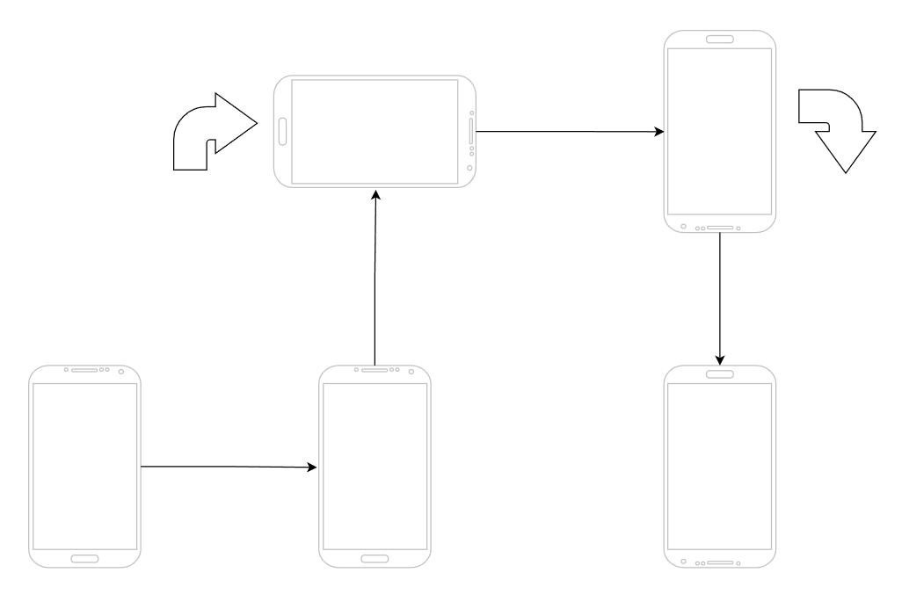
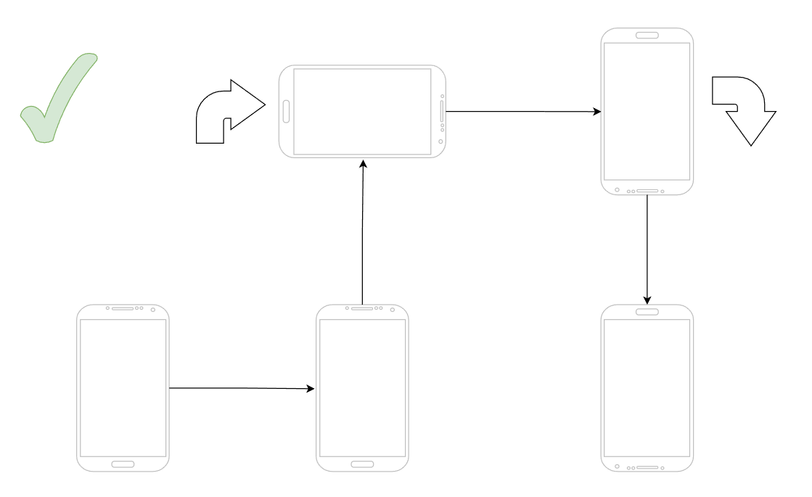
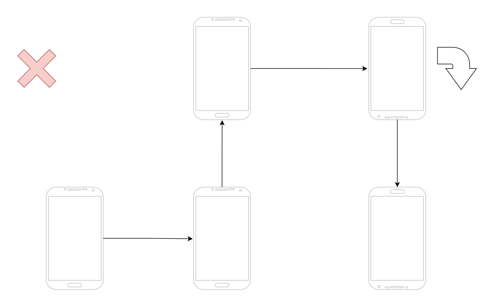
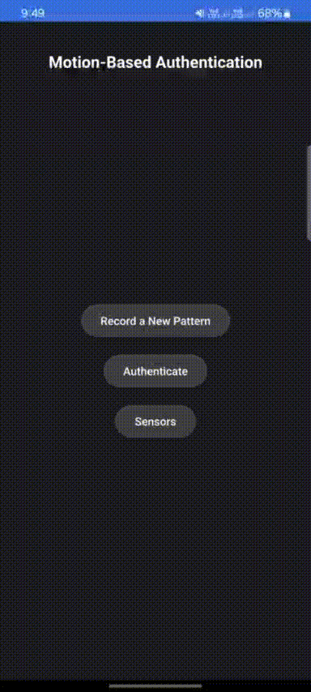
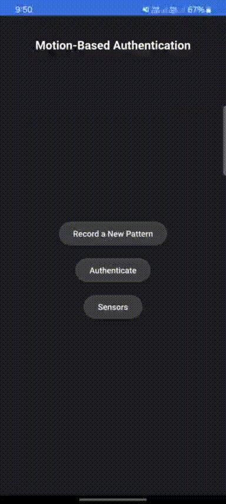

# CA2 - Motion Based Authentication

- [CA2 - Motion Based Authentication](#ca2---motion-based-authentication)
  - [Introduction](#introduction)
  - [Assumptions](#assumptions)
  - [Software Conceptual/Structural Design](#software-conceptualstructural-design)
    - [Application UI](#application-ui)
    - [Backend](#backend)
  - [Hardware/Software Platform Information](#hardwaresoftware-platform-information)
    - [Hardware Information](#hardware-information)
    - [Software Information](#software-information)
  - [Related Tools and Used Libraries](#related-tools-and-used-libraries)
  - [Tasks Division](#tasks-division)
  - [Test Settings and Scenarios](#test-settings-and-scenarios)
  - [Results](#results)
    - [Perfetto](#perfetto)
    - [Application](#application)
  - [Questions](#questions)
  - [References](#references)

## Introduction

This project focuses on the development of a motion-based authentication system for android phones. In this application, we'll record a pattern of motion data from the accelerometer and gyroscope sensors of the phone. This data will be used to authenticate the user. The application will compare the motion data of the user with the recorded data and shows the authentication result on the screen.

## Assumptions

We assumed that at each moment, the application is in only and only one of the following states:

- **Stopped**: The application is not recording or authenticating the motion data.
- **InRotation**: The application is recording the rotation of the phone.
- **InMovement**: The application is recording the movement of the phone.
- **Recognizing**: The application is recognizing the motion data. This is the initial state of the application.

## Software Conceptual/Structural Design

The application will be divided into two main parts: the UI and the backend. The UI will be responsible for showing the user the recording and authentication results and the backend will be responsible for processing the motion data and comparing it with the recorded data.

### Application UI

The UI is created using the Qt framework. We have used the QML language to create the UI using the QtQuick components. The UI consists of the following screens:

- **Home Screen**: This screen will be the first screen that the user sees when they open the application. It will have 3 buttons: `Record a New Pattern`, `Authenticate`, and `Sensors`. The `Record a New Pattern` button will take the user to the recording screen, the `Authenticate` button will take the user to the authentication screen, and the `Sensors` button will take the user to the sensors screen. This screen is designed in the `Main.qml` file.
- **Recording Screen**: This screen will show the user the recording process. The user will have to move the phone in a specific pattern to record the motion data. The screen will have a `Start Recording` button to start the recording process and a `Stop Recording` button to stop the recording process. This screen is designed in the `PatternPage.qml` file.
- **Authentication Screen**: This screen will show the user the authentication process. The user will have to move the phone in the same pattern as the recorded data to authenticate. The screen will have a `Start Authentication` button to start the authentication process and a `Stop Authentication` button to stop the authentication process. This screen is designed in the `PatternPage.qml` file.
- **Sensors Screen**: This screen will show the user the sensor data. The screen will have a `Calibrate` button to calibrate the sensors. This screen is designed in the `SensorsPage.qml` file.

There exists a cpp `Backend` class as a QML element which is responsible for the communication between the UI and the backend. The `Backend` class has the following methods:

- `startCalibration()`: This method is called when we want to calibrate the sensors.
- `startPatternRecording()`: This method is called when we've clicked the `Start Recording` button in the UI.
- `stopPatternRecording()`: This method is called when we've clicked the `Stop Recording` button in the UI.
- `startAuthentication()`: This method is called when we've clicked the `Start Authentication` button in the UI.
- `stopAuthentication()`: This method is called when we've clicked the `Stop Authentication` button in the UI.
- `startShowingSensors()`: This method is called when we enter the sensors' page.
- `stopShowingSensors()`: This method is called when we quit the sensors' page.

Also, the following signals are used to send data to the UI:

- `calibrationFinished(bool success)`
- `updateGyroData(qreal x, qreal y, qreal z, qreal xCal, qreal yCal, qreal zCal)`
- `updateAccelData(qreal x, qreal y, qreal z, qreal xCal, qreal yCal, qreal zCal)`
- `patternRecordingAddMovement(Movement* movement)`
- `patternRecordingUpdateMovement(Movement* movement)`
- `patternRecordingPopMovement()`
- `patternRecordingClearMovements()`
- `patternRecordingSuccessful()`
- `patternRecordingFailed(const QString& error)`
- `patternRecordingChangeAngle(const QString& angle)`
- `authenticationAddMovement(Movement* movement)`
- `authenticationUpdateMovement(Movement* movement)`
- `authenticationPopMovement()`
- `authenticationClearMovements()`
- `authenticationSuccessful()`
- `authenticationFailed(const QString& error)`
- `authenticationChangeAngle(const QString& angle)`

### Backend

TODO

## Hardware/Software Platform Information

### Hardware Information

The software is tested on a `Samsung Galaxy S21 Ultra` and `Samsung Galaxy A71` device with the following `arm64-v8a` CPU architecture.

### Software Information

The mentioned phones run `Android 14` and `Android 13` respectively.

## Related Tools and Used Libraries

The following tools and libraries are used in this project:

- **Qt**: The Qt framework is used to create the UI of the application.
- **QtSensors**: The QtSensors module is used to access the accelerometer and gyroscope sensors of the phone.
- **Eigen3**: The Eigen3 library is used to perform matrix operations in the backend. The library should be downloaded using [this link](https://gitlab.com/libeigen/eigen). Also, we should set the `EIGEN3_INCLUDE_DIR` environment variable.
- **Perfetto**: The Perfetto tool is used to trace the application and the sensors data.

## Tasks Division

TODO

## Test Settings and Scenarios

We have used the following settings for test:

- Distance Threshold: 10cm
- Angle Threshold: 45°
- Accelerometer Bias: 0.1
- Gyroscope Bias: 0.5
- Accelerometer Rate: 20Hz
- Gyroscope Rate: 100Hz
- Calibration Duration: 2s

Let's consider the following scenario for the pattern:

The successful scenario is as follows:

And the failure scenario is as follows:

## Results

Calibration and Pattern Recording:

Successful Authentication:

Failed Authentication:

### Perfetto

TODO

### Application

## Questions

1. **Using the Perfetto tool, trace and profile the application. Then, answer the following questions:**
   1. **What happens in the OS between a Read operation request from the sensors and the data being delivered to the application? How much time does it take?**

        TODO

   2. **Compare the sensors' rate in the Perfetto trace with the rate in the application.**

        TODO

   3. **Are there any conflicts (such as a thread's busy waiting until another thread finishes) between the processes (such as the GUI library) and the sensor readings? Justify your answers.**

        TODO

   4. **Compare the sensors' data processing time with other CPU processing time.**

        TODO

2. **What is the best rate for reading the `Accelerometer` and `Gyroscope` data? Justify your answers.**

    TODO

3. **What are hardware-based and software-based sensors? In which group does each of the mentioned sensors fit?**

    TODO

4. **What is difference between defining sensor as wake-up and non-wake-up? What are the pros and cons of each type? How does this affect on sensors' updates and recognizing the patterns?**

    TODO

## References

- [Sensors](https://source.android.com/devices/sensors/sensor-stack)
- [QtSensors](https://doc.qt.io/qt-6/qtsensors-index.html)
- [QtQuick](https://doc.qt.io/qt-6/qtquick-index.html)
- [Filters](https://www.youtube.com/watch?v=C7JQ7Rpwn2k)
- [Filters](https://code.google.com/archive/p/quadcopter-miami-ece/downloads)
- [Perfetto](https://perfetto.dev/docs/)
- [Tracing](https://perfetto.dev/docs/tracing-101)
- [Tracing](https://perfetto.dev/docs/quickstart/android-tracing)
- [Perfetto Config](https://perfetto.dev/docs/concepts/config)
- [Eigen3](https://gitlab.com/libeigen/eigen)
