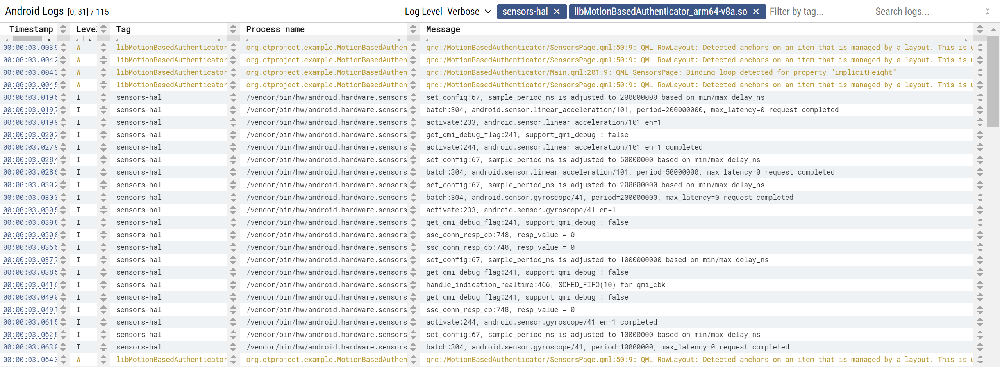
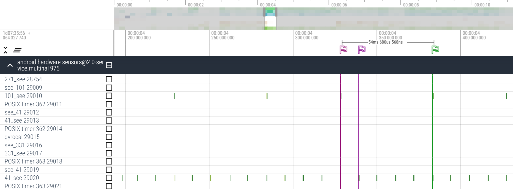
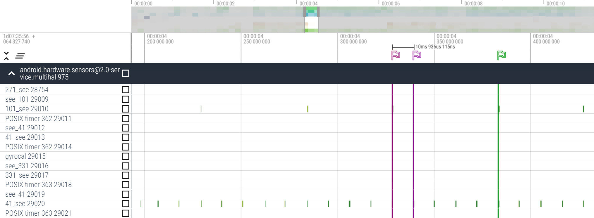
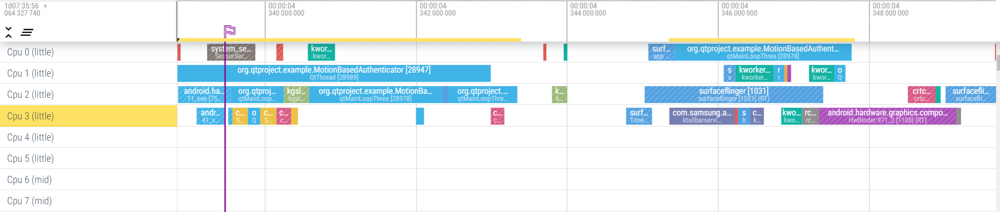
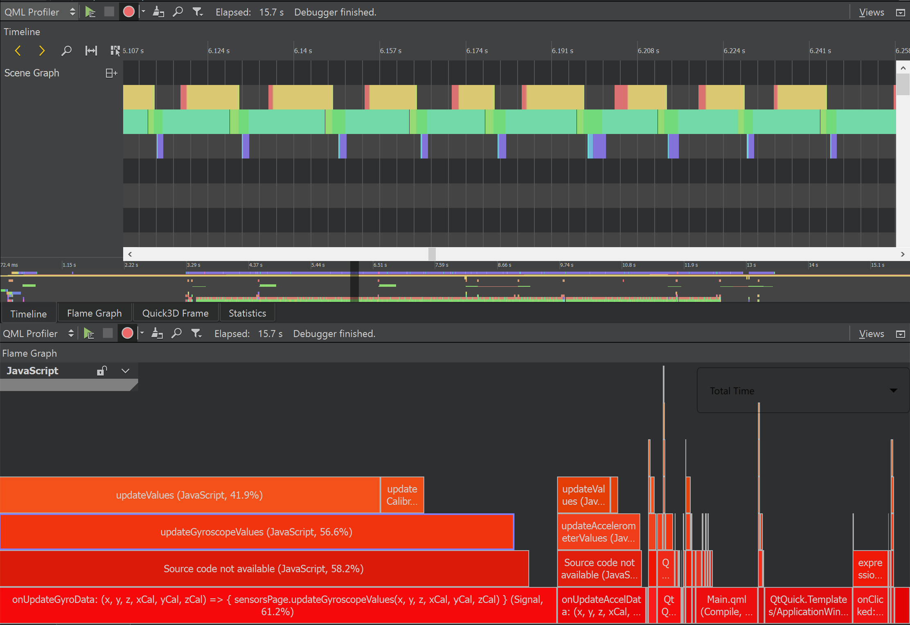
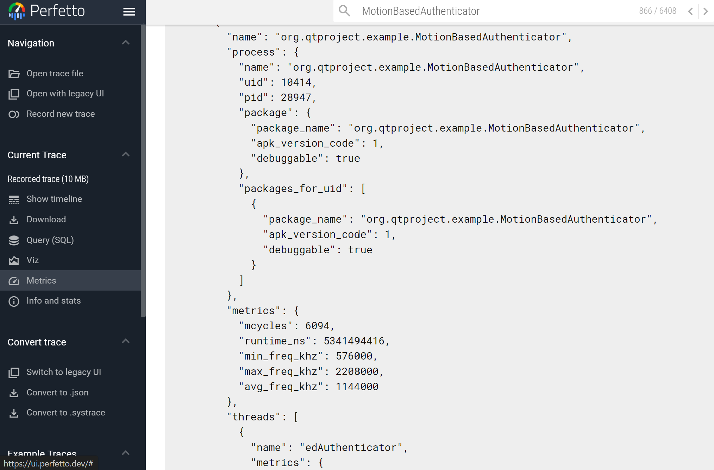
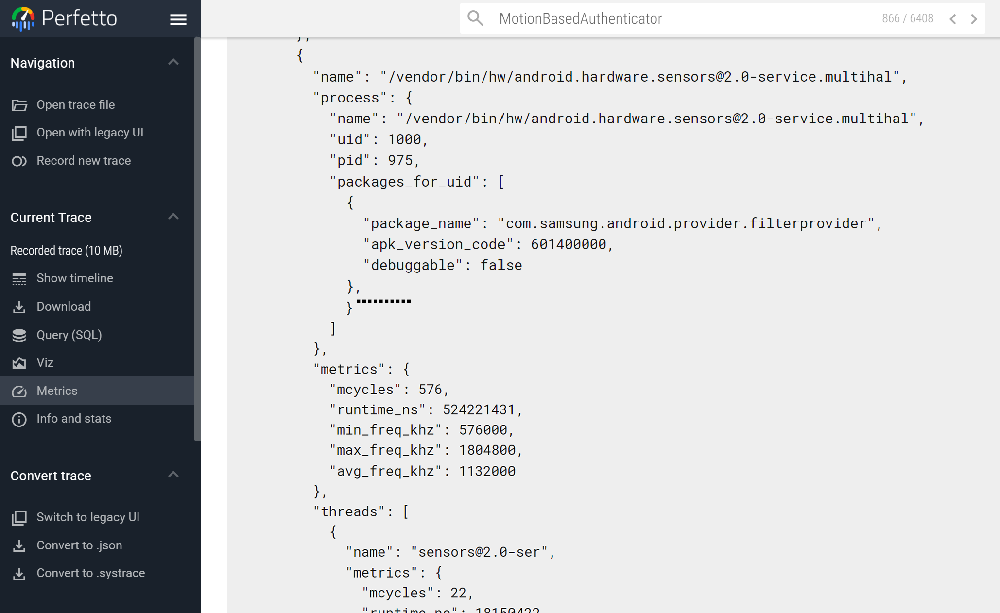

# CA2 - Motion Based Authentication

- [CA2 - Motion Based Authentication](#ca2---motion-based-authentication)
  - [Introduction](#introduction)
  - [Assumptions](#assumptions)
  - [Software Conceptual/Structural Design](#software-conceptualstructural-design)
    - [Application UI](#application-ui)
    - [Backend](#backend)
  - [Hardware/Software Platform Information](#hardwaresoftware-platform-information)
    - [Hardware Information](#hardware-information)
    - [Software Information](#software-information)
  - [Related Tools and Used Libraries](#related-tools-and-used-libraries)
  - [Tasks Division](#tasks-division)
  - [Test Settings and Scenarios](#test-settings-and-scenarios)
  - [Results](#results)
  - [Questions](#questions)
  - [References](#references)

## Introduction

This project focuses on the development of a motion-based authentication system for android phones. In this application, we'll record a pattern of motion data from the accelerometer and gyroscope sensors of the phone. This data will be used to authenticate the user. The application will compare the motion data of the user with the recorded data and shows the authentication result on the screen.

## Assumptions

We assumed that at each moment, the application is in only and only one of the following states:

- **Stopped**: The application is not recording or authenticating the motion data.
- **InRotation**: The application is recording the rotation of the phone.
- **InMovement**: The application is recording the movement of the phone.
- **Recognizing**: The application is recognizing the motion data. This is the initial state of the application.

## Software Conceptual/Structural Design

The application will be divided into two main parts: the UI and the backend. The UI will be responsible for showing the user the recording and authentication results and the backend will be responsible for processing the motion data and comparing it with the recorded data.

### Application UI

The UI is created using the Qt framework. We have used the QML language to create the UI using the QtQuick components. The UI consists of the following screens:

- **Home Screen**: This screen will be the first screen that the user sees when they open the application. It will have 3 buttons: `Record a New Pattern`, `Authenticate`, and `Sensors`. The `Record a New Pattern` button will take the user to the recording screen, the `Authenticate` button will take the user to the authentication screen, and the `Sensors` button will take the user to the sensors screen. This screen is designed in the `Main.qml` file.
- **Recording Screen**: This screen will show the user the recording process. The user will have to move the phone in a specific pattern to record the motion data. The screen will have a `Start Recording` button to start the recording process and a `Stop Recording` button to stop the recording process. This screen is designed in the `PatternPage.qml` file.
- **Authentication Screen**: This screen will show the user the authentication process. The user will have to move the phone in the same pattern as the recorded data to authenticate. The screen will have a `Start Authentication` button to start the authentication process and a `Stop Authentication` button to stop the authentication process. This screen is designed in the `PatternPage.qml` file.
- **Sensors Screen**: This screen will show the user the sensor data. The screen will have a `Calibrate` button to calibrate the sensors. This screen is designed in the `SensorsPage.qml` file.

There exists a cpp `Backend` class as a QML element which is responsible for the communication between the UI and the backend. The `Backend` class has the following methods:

- `startCalibration()`: This method is called when we want to calibrate the sensors.
- `startPatternRecording()`: This method is called when we've clicked the `Start Recording` button in the UI.
- `stopPatternRecording()`: This method is called when we've clicked the `Stop Recording` button in the UI.
- `startAuthentication()`: This method is called when we've clicked the `Start Authentication` button in the UI.
- `stopAuthentication()`: This method is called when we've clicked the `Stop Authentication` button in the UI.
- `startShowingSensors()`: This method is called when we enter the sensors' page.
- `stopShowingSensors()`: This method is called when we quit the sensors' page.

Also, the following signals are used to send data to the UI:

- `calibrationFinished(bool success)`
- `updateGyroData(qreal x, qreal y, qreal z, qreal xCal, qreal yCal, qreal zCal)`
- `updateAccelData(qreal x, qreal y, qreal z, qreal xCal, qreal yCal, qreal zCal)`
- `patternRecordingAddMovement(Movement* movement)`
- `patternRecordingUpdateMovement(Movement* movement)`
- `patternRecordingPopMovement()`
- `patternRecordingClearMovements()`
- `patternRecordingSuccessful()`
- `patternRecordingFailed(const QString& error)`
- `patternRecordingChangeAngle(const QString& angle)`
- `authenticationAddMovement(Movement* movement)`
- `authenticationUpdateMovement(Movement* movement)`
- `authenticationPopMovement()`
- `authenticationClearMovements()`
- `authenticationSuccessful()`
- `authenticationFailed(const QString& error)`
- `authenticationChangeAngle(const QString& angle)`

### Backend

The backend is responsible for processing the motion data and comparing it with the recorded data. The backend consists of the following classes and structures:

- **Acceleration**: This struct is responsible for holding the acceleration data of the phone.
- **AccelerometerHandler**: This class is responsible for reading the acceleration data from the accelerometer sensor and processing it.
- **Angle**: This class contains an Enum for the angles.
- **Authenticator**: This class is responsible for authenticating the user. It compares the motion data of the user with the recorded data.
- **Backend**: This class is responsible for the communication between the UI and the backend. It has the methods mentioned in the UI section.
- **Direction**: This class contains an Enum for the directions.
- **GyroscopeHandler**: This class is responsible for reading the gyroscope data from the gyroscope sensor and processing it.
- **KalmanFilter**: This class is responsible for filtering the sensor data.
- **Movement**: This class is responsible for holding the movement data of the phone.
- **MovementPattern**: This class is responsible for holding the pattern data of the phone.
- **PatternRecognizer**: This class is responsible for recognizing the pattern of the user.
- **PatternRecorder**: This class is responsible for recording the pattern of the user.
- **Rotation**: This class holds the rotation data of the phone.

## Hardware/Software Platform Information

### Hardware Information

The software is tested on a `Samsung Galaxy S21 Ultra` and `Samsung Galaxy A71` device with the following `arm64-v8a` CPU architecture.

### Software Information

The mentioned phones run `Android 14` and `Android 13` respectively.

## Related Tools and Used Libraries

The following tools and libraries are used in this project:

- **Qt**: The Qt framework is used to create the UI of the application.
- **QtSensors**: The QtSensors module is used to access the accelerometer and gyroscope sensors of the phone.
- **Eigen3**: The Eigen3 library is used to perform matrix operations in the backend. The library should be downloaded using [this link](https://gitlab.com/libeigen/eigen). Also, we should set the `EIGEN3_INCLUDE_DIR` environment variable.
- **Perfetto**: The Perfetto tool is used to trace the application and the sensors data.

## Tasks Division

The tasks and their division are as follows:

- **UI**:
  - **Home Screen**: Ali Padyav
  - **Pattern's Page**: Pasha Barahimi
  - **Sensors' Page**: Misagh Mohaghegh
  - **Integration with Backend**: Saman Eslami
- **Backend**:
  - **Acceleration**: Ali Padyav
  - **Accelerometer Handler**: Saman Eslami
  - **Angle**: Misagh Mohaghegh
  - **Authenticator**: Ali Padyav
  - **Backend**: Pasha Barahimi
  - **Direction**: Misagh Mohaghegh
  - **Gyroscope Handler**: Pasha Barahimi
  - **Kalman Filter**: Ali Padyav
  - **Movement**: Saman Eslami
  - **Movement Pattern**: Saman Eslami
  - **Pattern Recognizer**: Misagh Mohaghegh
  - **Pattern Recorder**: Misagh Mohaghegh
  - **Rotation**: Pasha Barahimi
- **Others**:
  - **Perfetto**: Misagh Mohaghegh, Saman Eslami
  - **README**: Ali Padyav, Pasha Barahimi

## Test Settings and Scenarios

We have used the following settings for test:

- Distance Threshold: 10cm
- Angle Threshold: 45°
- Accelerometer Bias: 0.1
- Gyroscope Bias: 0.5
- Accelerometer Rate: 20Hz
- Gyroscope Rate: 100Hz
- Calibration Duration: 2s

Let's consider the following scenario for the pattern:

The successful scenario is as follows:

And the failure scenario is as follows:

## Results

Calibration and Pattern Recording:

Successful Authentication:

Failed Authentication:

## Questions

1. **Using the Perfetto tool, trace and profile the application. Then, answer the following questions:**
   1. **What happens in the OS between a Read operation request from the sensors and the data being delivered to the application? How much time does it take?**
    There is an abstraction layer between the underlying physical sensor hardware and the API that Android apps use.  
    The API defined by Android sensors framework (such as SensorEventListener) is used by apps which uses the hardware abstraction layer (HAL) to get the required data from the hardware.  
    When a request is made from an app to read a sensor's data, it is done through the sensors framework which uses the Sensors HAL to get the response from the hardware.  
    The response goes back to the HAL and over the framework to reach the application.
    
    As we can see, after our Qt program is launched, the `sample_period_ns` of the accelerometer sensor is set to a default value, which changes to our set frequency (20hz) quickly afterwards. The same is for the gyroscope which changes to a 100hz polling frequency.  
    For example, our request for the linear acceleration sensor to change its frequency was sent on 00:00:03.028497238 and received on 00:00:03.028676040 which took about 0.18ms.

   2. **Compare the sensors' rate in the Perfetto trace with the rate in the application.**
    Setting the frequency of sensors in Qt does not actually guarantee a reliable change in the hardware, but it usually does if the number is reasonable.  
    We can check if setting our accelerometer to 20hz and our gyroscope to 100hz was successful:
    
    As we can see, the distance between 2 readings of the accelerometer is about 54ms here. the next distance is 46ms.  
    To achieve 20hz frequency, there should be a reading every 50ms. Whilst the timings are not exactly 50ms, they average out to 50ms which is $1000/50=20$ readings per second.
    
    Here the distance is 11ms which is close to 10ms needed to have $1000/10=100$ readings per second.

   3. **Are there any conflicts (such as a thread's busy waiting until another thread finishes) between the processes (such as the GUI library) and the sensor readings? Justify your answers.**
    There may be slight conflicts but it is mostly handled by the OS and the hardware using interrupts and other mechanisms.  
    Event queues may be used to gather the sensor data so it can be processed later without loss.  
    The sensors framework is designed to be asynchronous and non-blocking so that the app can continue to run without waiting for the sensor data to be ready and busy waiting problems.
    
    

   4. **Compare the sensors' data processing time with other CPU processing time.**
    We except the sensor reading to not take much time as it is a simple and lightweight operation compared to other CPU tasks.  
    Sensors are used extensively in mobile and embedded systems where resources are limited and the CPU is needed for other tasks.
    
    
    As we can see, our application has a runtime of about 5 seconds (the profiling duration was 15 seconds).  
    Meanwhile, the sensor runtime is about 0.5 seconds.

2. **What is the best rate for reading the `Accelerometer` and `Gyroscope` data? Justify your answers.**
  The best period for reading acceleration and gyroscope sensor values depends on the application.  
  Usually there has to be a balance between accuracy, power consumption and performance.  
  The values usually range from 10hz to 100hz based on the application.  
  For this project, 20hz were used for the accelerometer and 100hz for the gyroscope which has yielded good results.  
  If the frequency is too low (the period is too large), we could miss important moves and changes and have less detail and smoothness in the outcome.  
  If the frequency is too high (the period is too small), we would require much higher processing power and battery consumption which is not efficient. There could also be inaccuracies due to noise.

3. **What are hardware-based and software-based sensors? In which group does each of the mentioned sensors fit?**
  Hardware-based sensors sensors are physical devices that measure specific physical quantities (such as temperature or light). The accelerometer and gyroscope fall into this category. They directly sense motion and orientation using technologies such as MEMS (Micro-Electro-Mechanical Systems).  
  Software-based sensors derive data by processing outputs and data of other existing sources (such as past data) or one or more hardware-based sensors. They use algorithms to provide higher-level information and predict or estimate the behavior of physical sensors or introduce new information. These sensors are a cost-effective way to provide additional data without the need for additional hardware.  
  For example, the linear acceleration sensor is a software-based sensor that derives its data from the accelerometer sensor by removing the effect of gravity. The step counter sensor is another example that uses the accelerometer to detect steps.  
  The two sensors used in this project are both hardware-based.

4. **What is difference between defining sensor as wake-up and non-wake-up? What are the pros and cons of each type? How does this affect on sensors' updates and recognizing the patterns?**
  Wake-up sensors are used to wake up the device from a low-power state when a certain condition is met. They are used to reduce power consumption by keeping the device in a low-power state until a specific event occurs.  
  Non-wake-up sensors are sensors that do not wake up the device from a low-power state. They are used to provide continuous and realtime monitoring of the environment or the device without waking it up.  
  Non-wake-up sensors are simpler, usually have more functionality and do not enter sleep mode. They have low latency and high accuracy and are used for realtime monitoring.  
  Non-wake-up sensors have higher power consumption as they are always active and use energy even when the device is idle.  
  Wake-up sensors can only activate when needed and are more power-efficient. They are used for events that do not require continuous monitoring.  
  Wake-up sensors have higher latency as they need to wake up the device before providing data.  
  Using wake-up sensors, the motion based authentication process can begin as soon as the device is picked up. The device can remain in a low-power state until the wake-up sensor detects the correct motions. This can save power and improve the user experience while non-wake-up sensors would require the device to be already active to read sensor data.

## References

- [Sensors](https://source.android.com/devices/sensors/sensor-stack)
- [QtSensors](https://doc.qt.io/qt-6/qtsensors-index.html)
- [QtQuick](https://doc.qt.io/qt-6/qtquick-index.html)
- [Filters](https://www.youtube.com/watch?v=C7JQ7Rpwn2k)
- [Filters](https://code.google.com/archive/p/quadcopter-miami-ece/downloads)
- [Perfetto](https://perfetto.dev/docs/)
- [Tracing](https://perfetto.dev/docs/tracing-101)
- [Tracing](https://perfetto.dev/docs/quickstart/android-tracing)
- [Perfetto Config](https://perfetto.dev/docs/concepts/config)
- [Eigen3](https://gitlab.com/libeigen/eigen)
